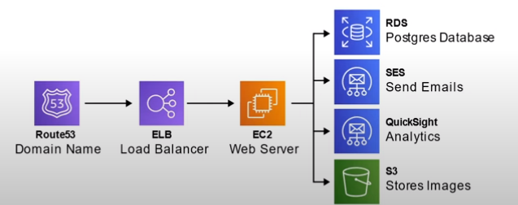

## What is Cloud Computing?
___
The practice of using a network of remote servers hosted on the internet to store, manage and process data, rather than a local server or a personal computer.

### On-Premise
- You own the servers
- You hire the IT people
- You pay or rent the real-estate
- You take all the risk
### Cloud Providers
- Someone else owns the servers
- Someone else hires the IT people
- Someone else pays or rents the real-estate
- You are responsible for configuring cloud services and code, someone else takes care of the rest

## The Evolution of Cloud Hosting
___
### Dedicated Server
- *One physical machine* dedicated *to a single business*. Runs a single web-app / site
- Very Expensive, High maintenance, \*high security
### Virtual Private Server
- *One physical machine* dedicated *to a single business*. The physical machine is virtualized *into sub-machines*. Runs multiple web-apps / sites
- Better utilization and isolation of resources
### Shared Hosting
- *One physical machine*, shared by *hunders of businesses*. Relies on most tenants under-utilizing their resources.
- Very cheap, Limited functionality, Poor isolation
### Cloud Hosting
- *Multiple physical machines* that act as one system. The system is abstracted into multiple *cloud services*.
- Flexible, Scalable, Secure, Cost-Effective, High configurability
## What is Amazon?
___
- An American multinational computer technology corporation headquartered in *Seattle, Washington*
- Amazon was founded in 1994 by *Jeff Bezos* and the company started as an online store for books and expanded to other products

## What is Amazon Web Services (AWS)? 
___
- What Amazon calls their cloud provider service
- Launched in *2006*, it is the leading cloud service provider (CSP) in the world
- Simple Queue Service (SQS) was the first AWS service launched for public use in 2004
- Simple Storage Service (S3) was launched in March of 2006
- Elastic Compute Cloud (EC2) was launched in Auguest of 2006
- In November of 2010, it was reported that all of Amazon.com's retail sites had migrated to AWS
- To support industry-wide training and skills standardization, AWS began offering a certification program for computer engineers, on April, 2013
- Adam Selipsky: CEO of AWS. former CTO of Tableau, spent a decade with AWS as VP of Marketing, Sales and Support
- Werner Vogels: CTO of AWS. "Everything fails, all the time"
- Jeff Barr: Chief Evangelist

## What is a Cloud Service Provider?
__
A company which:
- Provides multiple Cloud Services (10s to 100s of services)
- Allows the Cloud Services *to be chained together* to create cloud architectures
- Makes the Cloud Services accessible *via a Single Unified API* (AWS API)
- Offers Cloud Services which utilize *metered billing* based on usage (per second, per hour)
- Provide rich monitoring built in to the Cloud Services (AWS CloudTrail)
- Provide Infrastructure as a Service (IaaS) offering
- Offers *automation* via infrastructure as Code (IaC) on those Cloud Services

Example:

- If a company offers multiple cloud services under a single UI, but does not meet most or all of these requirements, it would be referred to as a Cloud Platform (Twilio, HashiCorp, Databricks)

## Landscape of CSPs
___
**Tier-1 (Top Tier):** Early to market, wide offering, strong synergies between services, well recognized in the industry
- Amazon Web Services (AWS)
- Microsoft Azure
- Google Cloud Platform (GCP)
- Alibaba Cloud

**Tier-2 (Mid Tier):** Backed by well-known tech companies, slow to innovate and turned to specialization
- IBM Cloud
- Oracle Cloud
- Rackspace (OpenStack)

**Tier-3 (Light Tier):** Virtual Private Servers (VPS) turn to offer core IaaS offering. Simple, cost-effective
- Vultr
- Digital Ocean
- Linode

## Gartner Magic Quadrant for Cloud
___
Magic Quadrant (MQ): a series of market research reports published by IT consulting firm Gartner that rely on proprietary qualitative data analysis methods to demonstrate merket trends, such as direction, maturity and participants

## Common Cloud Services
___
A cloud service provider can have hundreds of cloud services that are grouped into various types of services. The four most common types of cloud services (the 4 core) for Infrastructure as a service (IaaS) would be:
1. Compute
	- Imagine having a virtual computer that can run application, programs and code
2. Networking
	- Imagine having a virtual network defining internet connections or network isolations between services or outbound to the internet
3. Storage
	- Imagine having a virtual hard-drive that can store files
4. Databases
	- Imagine a virtual database for storing reporting data or a database for general purpose web-application

AWS has over 200+ cloud services
The term "Cloud Computing" can be used to refer to all categories, even though it has "compute" in the name

## Technology Overview
___
Cloud Service Providers (CSPs) that  are Infrastructure as a service (IaaS) will always have 4 core cloud service offerings:
1. Compute (EC2 Virtual Machines)
2. Storage (EBS Virtual Hard Drives)
3. Database (RDS SQL Databases)
4. Networking and Content Delivery (VPC Private Cloud Network)
Additional offerings can include:
- Analytics
- Application Integration
- AR & VR
- AWS Cost Management
- Blockchain
- Business Applications
- Containers
- Customer Engagement
- Developer Tools
- End User Computing
- Game Tech
- Internet of Things
- Machine Learning
- Management & Governance
- Media Services
- Migration & transfer
- Mobile
- Quantum Technologies
- Robotics
- Satellites
- Security, Identity & Compliance
- etc.

## AWS Services Preview
https://aws.amazon.com/certification/certified-solutions-architect-associate/?sc_channel=ha&sc_icampaign=aware_global_200_certification_spotlight_solutionsarchitectassociate_ribbon_tnc&sc_ichannel=ha&sc_icontent=awssm-1249_tnc_aware&sc_iplace=ribbon&trk=4dd900a1-c8e5-4f60-8713-8915415f2c67~ha_awssm-1249_tnc_aware
(See Products at top left)

## The Evolution of Computing
Dedicated
- A physical server wholly utilized by a single customer
- You have to guess your capacity
- You'll overpay for an underutilized server
- You can't vertical scale, you need a manual migration
- Replacing a server is very difficult
- You are limited by your host Operating System
- Multiple apps can result in conflicts in resource sharing
- You have a guarantee of security, privacy and full utility of underlying resources
Virtual Machines (VMs)
- You can run multiple virtual machines on one machine
- Hypervisor is the software layer that lets you run the VMs
- A physical server shared by multiple customers
- You are to pay for a fraction of the server
- You'll overpay for an underutilized Virtual Machine
- You are limited by your guest Operating System
- Multiple apps on a single Virtual Machine can result in conflicts in resource sharing
- Easy to export or import images for migration
- Easy to vertically or horizontally scale
Containers
- Virtual Machine running multiples containers
- Docker Daemon is the name of the software later that lets you run multiple containers
- You can maximize the utility of the available capacity which is more cost-effective
- Your containers share the same underlying OS so containers are more efficient that multiple VMs
- Multiple apps can run side by side without being limited to the same OS requirements and will not cause conflicts during resource sharing
Functions
- Are managed VMs running managed containers
- Known as Serverless Compute
- You upload a piece of code, choose the amount of memory and duration.
- Only responsible for code and data, nothing else
- Very cost-effective, only pay for the time code is running, VMs only run when there is code to be executed
- Cold Starts is a side-effect of this setup (VMs take time to "spin up")
## Types of Cloud Computing
### SaaS (Software as a Service) - For Customers
A product that is run and managed by the service provider. Don't worry about how the service is maintained. It just works and remains available (Gmail. Salesforce, Office365)
### PaaS (Platform as a Service) - For Developers
Focus on the deployment and management of your apps. Don't worry about provisioning, configuring or understanding the hardware or OS (Elastic Beanstalk, Heroku, Google App Engine)
IaaS (Infrastructure as a Service) - For Admins
The basic building blocks for cloud IT. Provides access to networking features, computers and data storage space. Don't worry about IT staff, data centers and hardware. (Microsoft Azure, AWS, Oracle Cloud)

## Cloud Computing Deployment Models
### Public Cloud
- Everything (the workload or project) is built on the CSP. Also known as: Cloud-Native or Cloud First
### Private Cloud
- Everything built on company's datacenters. Also known as On-Premise. The cloud could be OpenStack
### Hybrid
- Using both On-Premise and a Cloud Service Provider
### Cross-Cloud
- Using Multiple Cloud Providers. AKA Multi-Cloud, "hybrid-cloud"
